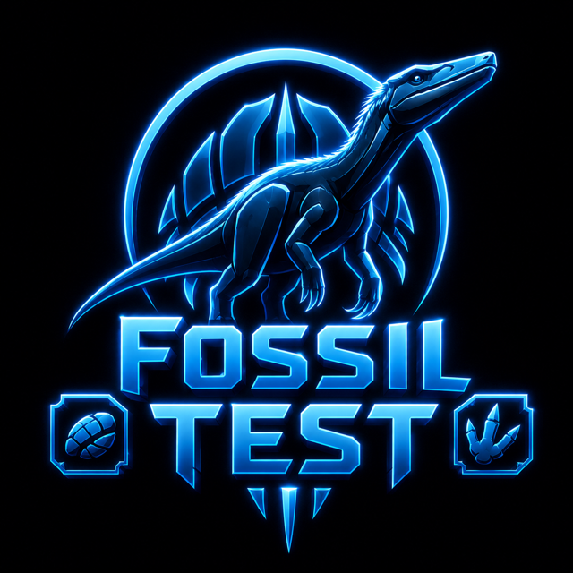

<p align="center">
    
</p>

# ***Fossil Test by Fossil Logic***

**Fossil Test** is a unit testing framework from **Fossil Logic** designed for C and C++ projects that require precision, clarity, and control. It focuses on producing reliable, easy-to-understand test results while supporting detailed verification of logic, memory behavior, and system correctness. The framework is well-suited for low-level components, performance-critical code, and environments where predictable behavior matters.

With Fossil Test, developers can build clean, structured tests that fit naturally into existing workflows. Whether you're validating core algorithms, exercising system interfaces, or ensuring API stability, Fossil Test provides a straightforward and dependable approach to testing.

---

## Key Features

| Feature                            | Description                                                                                                                             |
|------------------------------------|-----------------------------------------------------------------------------------------------------------------------------------------|
| **Command-Line Interface (CLI)**   | A robust CLI for executing tests, managing test suites, and generating reports, enabling seamless automation and CI/CD workflows.      |
| **Traceable Test Metadata**        | Each test case carries timestamped, hashed metadata for traceability and reproducibility, ensuring full accountability of test results.|
| **Support for Multiple Testing Styles** | Compatible with Behavior-Driven Development (BDD), Domain-Driven Design (DDD), and Test-Driven Development (TDD) methodologies.   |
| **Mocking Capabilities**           | Advanced mocking tools to simulate complex dependencies and edge conditions, enabling isolated and deterministic testing.              |
| **Benchmarking Tools**             | Integrated benchmarking features to measure runtime performance, identify slow paths, and guide optimization.                         |
| **Sanity Kit for Command Tests**   | A specialized module for validating command-line tools, ensuring consistent behavior across platforms and shell environments.         |
| **Customizable Output Themes**     | Multiple output formats and visual themes (e.g., maip, catch, doctest) to match your preferred style of feedback.                    |
| **Tag-Based Test Filtering**       | Execute subsets of tests based on custom tags for better test suite organization and faster iteration.                                |
| **Detailed Performance Insights**  | In-depth statistics on execution time, memory usage, and test stability to help improve code performance and reliability.              |
| **Objective-C & Objective-C++ Support (macOS)** | Full compatibility with Objective-C and Objective-C++ projects on macOS, allowing testing of Apple-specific frameworks and apps.  |

## Command-Line

The Fossil Test CLI provides an efficient way to run and manage tests directly from the terminal. Here are the available commands and options:

### Commands and Options

| Command        | Description                                    | Flags / Options                                                                 |
|---------------|------------------------------------------------|---------------------------------------------------------------------------------|
| `--version, -v` | Show version information.                       | -                                                                               |
| `--info, -i`    | Show detailed build, runtime, and framework information. | `--os, --arch, --memory, --endian, --self`                                   |
| `--dry-run`     | Perform a dry run without executing commands.   | -                                                                               |
| `--host`        | Show information about the current host.        | -                                                                               |
| `--help, -h`    | Show help and usage information.                | -                                                                               |
| `help`          | Display help for commands and options.          | `help <command>, <command> --help`                                                |
| `run`           | Execute tests.                                  | `--fail-fast, --only <test>, --skip <test>, --repeat <count>`                    |
| `filter`        | Filter tests based on criteria.                 | `--test-name <name>, --suite-name <name>, --tag <tag>, --help, --options`       |
| `sort`          | Sort tests by specified criteria.               | `--by <criteria>, --order <asc/desc>, --help, --options`                         |
| `shuffle`       | Shuffle tests.                                  | `--seed <seed>, --count <count>, --by <criteria>, --help, --options`            |
| `show`          | Show test cases.                                | `--test-name <name>, --suite-name <name>, --tag <tag>, --result <result>, --verbose <level>, --mode <mode>` |
| `color <mode>`  | Set color mode.                                 | `enable, disable, auto`                                                            |
| `theme <name>`  | Set the theme for output.                       | `fossil, light, dark, maga`                                                        |
| `timeout=<sec>` | Set the timeout for commands (default: 60s).    | -                                                                               |
| `report`        | Export test results for CI integration.         | `--format <json/fson/yaml/csv>, --destination <file/stdout>`                     |

> **Help System:** Fossil Test CLI provides both global and command-specific help. Running `--help` displays the main usage guide, available commands, global options, examples, and general documentation. You can also request detailed help for any command by using `help <command>` or `<command> --help` (for example, `help run`, `run --help`, `help filter`, or `filter --help`). Command-specific help includes syntax, supported options, defaults, examples, and additional notes relevant to that command. This allows documentation to be accessed directly from the terminal without requiring external references.

---

## ***Prerequisites***

To get started, ensure you have the following installed:

- **Meson Build System**: If you don’t have Meson `1.8.0` or newer installed, follow the installation instructions on the official [Meson website](https://mesonbuild.com/Getting-meson.html).

---

### Adding Dependency

#### Adding via Meson Git Wrap

To add a git-wrap, place a `.wrap` file in `subprojects` with the Git repo URL and revision, then use `dependency('fossil-test')` in `meson.build` so Meson can fetch and build it automatically.

#### Integrate the Dependency:

Add the `fossil-test.wrap` file in your `subprojects` directory and include the following content:

```ini
[wrap-git]
url = https://github.com/fossillogic/fossil-test.git
revision = v2.0.0

[provide]
dependency_names = fossil-test
```

**Note**: For the best experience, always use the latest release of Fossil Test. Visit the [Fossil Test Releases](https://github.com/fossillogic/fossil-test/releases) page for the latest versions.

## Configure Build Options

To configure the build system with testing enabled, use the following command:

```sh
meson setup builddir -Dwith_test=enabled
```

#### Tests Double as Samples

The `fossil-test` project is designed so that **test cases serve two purposes**:

- ✅ **Unit Tests** – validate the framework’s correctness.  
- 📖 **Usage Samples** – demonstrate how to write tests with `fossil-test`.  

This approach keeps the codebase compact and avoids redundant “hello world” style examples.  
Instead, the same code that proves correctness also teaches usage.  

This mirrors the **Meson build system** itself, which tests its own functionality by using Meson to build Meson.  
In the same way, `fossil-test` validates itself by demonstrating real-world usage in its own tests.  

```bash
meson test -C builddir -v
```

Running the test suite gives you both verification and practical examples you can learn from.

---

## ***Contributing and Support***

If you would like to contribute, have questions, or need help, feel free

---

## ***Conclusion***

Fossil Test is a powerful and flexible framework for C and C++ developers, designed to support a wide range of testing methodologies such as BDD, DDD, and TDD. With features like mocking, detailed reporting, and performance tracking, Fossil Test empowers developers to create high-quality software and maintainable test suites. Combined with Pizza Mark and Pizza Mock, it provides a complete suite for testing, optimization, and dependency management. Whether you're building small projects or large-scale applications, Fossil Test is an essential tool to ensure the reliability and performance of your code.
